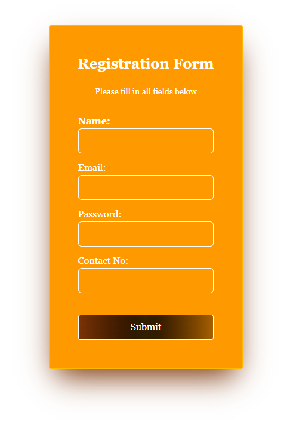

# React Registration Form

A simple registration form built with React, Vite, and Tailwind CSS. The form includes validation for name, email, password, and Bangladeshi contact number.

## Demo Screenshot: 

## Features

- React functional components with hooks
- Form validation:
  - All fields required
  - Email format validation
  - Password must be at least 8 characters, include uppercase, lowercase, and a number
  - Bangladeshi contact number validation (starts with 01 and 11 digits total)
- Tailwind CSS for styling
- Responsive and modern UI

## Getting Started

### Prerequisites

- Node.js (v16 or higher recommended)
- npm

### Installation

1. Clone the repository:

   git clone https://github.com/selina-islam/react-form-control.git
   cd react-form-control

